# 📚 Documentation Complète - Kids Points System

## Table des Matières
1. [Vue d'Ensemble](#vue-densemble)
2. [Architecture Technique](#architecture-technique)
3. [Zones Fonctionnelles](#zones-fonctionnelles)
4. [Workflows Détaillés](#workflows-détaillés)
5. [Système de Permissions](#système-de-permissions)
6. [Gestion des États](#gestion-des-états)
7. [API & Services](#api--services)
8. [Design System](#design-system)
9. [Sécurité & Validation](#sécurité--validation)
10. [Déploiement & Configuration](#déploiement--configuration)

---

## 🎯 Vue d'Ensemble

### Concept Principal
**Kids Points System** est une application web progressive (PWA) de gestion de tâches et récompenses familiales gamifiée. Elle permet aux parents de créer des missions que les enfants complètent pour gagner des points, échangeables contre des récompenses.

### Objectifs
- **Éducatif**: Enseigner la valeur du travail et de l'effort
- **Motivationnel**: Gamification pour encourager les bonnes habitudes
- **Familial**: Renforcer les liens parent-enfant par un système positif
- **Évolutif**: S'adapter à l'âge et aux besoins de chaque enfant

### Utilisateurs Cibles
- **Parents**: 25-45 ans, gestion et supervision
- **Enfants**: 4-16 ans, divisés en groupes d'âge
  - Young (4-6 ans): Interface ultra-simplifiée
  - Child (7-10 ans): Interface ludique standard
  - Teen (11-16 ans): Interface plus mature

---

## 🏗️ Architecture Technique

### Stack Technologique

#### Frontend
```typescript
// Core
- React 18.3.1 avec TypeScript 5.4.2
- Vite 6.3.5 (build tool)
- React Router 7.0.2 (navigation)

// State Management
- Redux Toolkit 2.5.0
- React Query (TanStack Query 5.x)
- localStorage pour persistance locale

// UI & Styling
- Tailwind CSS 3.4.17
- Framer Motion 11.15.0 (animations)
- Heroicons 2.2.0 (icônes)
- Custom Design System (dual-theme)

// PWA & Performance
- vite-plugin-pwa 0.21.3
- Service Workers
- IndexedDB pour cache offline
```

#### Structure des Dossiers
```
src/
├── components/          # Composants réutilisables
│   ├── ui/             # Composants UI de base
│   │   ├── v2/         # Nouvelle version du design system
│   │   └── legacy/     # Anciens composants
│   ├── cards/          # Cartes spécialisées
│   └── modals/         # Modales et overlays
├── features/           # Modules fonctionnels
│   ├── auth/          # Authentification
│   ├── children/      # Gestion enfants
│   ├── missions/      # Gestion missions
│   └── rewards/       # Gestion récompenses
├── pages/             # Pages de l'application
├── services/          # Services API
├── store/             # Redux store
│   ├── slices/       # Redux slices
│   └── api/          # RTK Query endpoints
├── hooks/            # Custom React hooks
├── utils/            # Utilitaires
├── types/            # Types TypeScript
└── styles/           # Styles globaux
```

### Modèle de Données

#### User (Parent)
```typescript
interface User {
  id: number;
  email: string;
  name: string;
  role: 'parent' | 'admin';
  created_at: Date;
  settings: UserSettings;
}
```

#### Child (Enfant)
```typescript
interface Child {
  id: number;
  parent_id: number;
  name: string;
  age: number;
  avatar: string;
  current_points: number;
  total_points_earned: number;
  level: number;
  badges: Badge[];
  created_at: Date;
  settings: ChildSettings;
}
```

#### Mission
```typescript
interface Mission {
  id: number;
  parent_id: number;
  name: string;
  description: string;
  icon: string;
  points_reward: number;
  category: MissionCategory;
  difficulty: 'easy' | 'medium' | 'hard';
  recurrence: 'once' | 'daily' | 'weekly';
  assigned_to: number[] | 'all';
  is_active: boolean;
  completed_by: number[];
  created_at: Date;
  expires_at?: Date;
}
```

#### Reward
```typescript
interface Reward {
  id: number;
  parent_id: number;
  name: string;
  description: string;
  icon: string;
  points_cost: number;
  category: RewardCategory;
  stock?: number;
  is_active: boolean;
  claimed_by: ClaimRecord[];
  created_at: Date;
}
```

#### Validation Request
```typescript
interface ValidationRequest {
  id: string;
  type: 'mission' | 'reward';
  child_id: number;
  item_id: number;
  status: 'pending' | 'approved' | 'rejected';
  requested_at: Date;
  processed_at?: Date;
  processed_by?: number;
  notes?: string;
}
```

---

## 🎮 Zones Fonctionnelles

### 1. Zone Authentification

#### Login Flow


**Composants**:
- `/login` - Page de connexion
- `AuthProvider` - Context provider
- `authSlice` - Redux slice
- `authService` - API service

**Sécurité**:
- JWT avec expiration 7 jours
- Refresh token automatique
- Validation côté serveur
- Protection CSRF

### 2. Zone Parent (Admin)

#### Dashboard Parent
**Route**: `/dashboard`
**Permissions**: `role: parent`

**Fonctionnalités**:
- Vue d'ensemble statistiques
- Liste des enfants avec points
- Actions rapides
- Notifications en attente

**Composants Clés**:
```typescript
- Dashboard.tsx           // Page principale
- StatsCard.tsx          // Cartes statistiques
- ChildrenList.tsx       // Liste enfants
- QuickActions.tsx       // Actions rapides
- NotificationBadge.tsx  // Badge notifications
```

#### Gestion des Enfants
**Route**: `/children`

**CRUD Operations**:
```typescript
// CREATE
POST /api/children
{
  name: string,
  age: number,
  avatar: string,
  initial_points?: number
}

// READ
GET /api/children
GET /api/children/:id

// UPDATE
PUT /api/children/:id
{
  name?: string,
  age?: number,
  avatar?: string,
  current_points?: number
}

// DELETE
DELETE /api/children/:id
```

#### Gestion des Missions
**Route**: `/missions/manage`

**États Mission**:
- `draft` - En création
- `active` - Disponible pour enfants
- `completed` - Terminée par au moins un enfant
- `archived` - Archivée par parent

**Workflow Création**:
1. Formulaire création
2. Validation données
3. Sauvegarde draft
4. Activation
5. Notification enfants

#### Gestion des Récompenses
**Route**: `/rewards/manage`

**Stock Management**:
```typescript
interface StockTracking {
  initial_stock: number;
  current_stock: number;
  reserved: number;  // En attente validation
  distributed: number;
  history: StockChange[];
}
```

### 3. Zone Enfant

#### Sélection Profil
**Route**: `/select-child`

**Process**:
1. Affichage avatars disponibles
2. Animation au survol
3. Clic = sélection
4. Stockage `selectedChildId` en localStorage
5. Redirection dashboard enfant

#### Dashboard Enfant
**Route**: `/child/:id/dashboard`

**Widgets**:
- Points actuels (gros affichage)
- Niveau & progression
- Missions du jour
- Derniers badges gagnés
- Mini-leaderboard famille

#### Missions Disponibles
**Route**: `/missions` ou `/missions/:childId`

**Filtres & Tri**:
```typescript
interface MissionFilters {
  category?: MissionCategory;
  difficulty?: 'easy' | 'medium' | 'hard';
  points?: { min: number; max: number };
  availability?: 'available' | 'completed' | 'locked';
  sort?: 'points_asc' | 'points_desc' | 'newest' | 'easiest';
}
```

**États Visuels**:
- 🟢 **Available**: Peut être complétée
- 🟡 **Pending**: En attente validation parent
- ✅ **Completed**: Validée et points reçus
- 🔒 **Locked**: Conditions non remplies
- ⏰ **Expired**: Délai dépassé

#### Boutique Récompenses
**Route**: `/rewards` ou `/rewards/:childId`

**Calcul Disponibilité**:
```typescript
const canClaim = (reward: Reward, child: Child): boolean => {
  return (
    child.current_points >= reward.points_cost &&
    reward.is_active &&
    (reward.stock === undefined || reward.stock > 0)
  );
};
```

---

## 🔄 Workflows Détaillés

### Workflow 1: Validation de Mission

```mermaid
sequenceDiagram
    participant E as Enfant
    participant F as Frontend
    participant S as State/Store
    participant A as API
    participant P as Parent
    
    E->>F: Clique "Compléter Mission"
    F->>S: Dispatch completeMission(missionId, childId)
    S->>A: POST /api/validations/request
    A-->>S: Return pendingRequest
    S->>S: Add to pendingRequests
    S-->>F: Update UI (mission = pending)
    F-->>E: Affiche "En attente"
    
    Note over P: Parent reçoit notification
    P->>F: Ouvre /validate-missions
    F->>A: GET /api/validations/pending
    A-->>F: Liste validations en attente
    P->>F: Clique "Approuver"
    F->>A: POST /api/validations/approve
    A->>A: Add points to child
    A->>A: Mark mission completed
    A-->>F: Success response
    F->>S: Update child points
    F->>S: Update mission status
    F-->>P: Affiche confirmation
    
    Note over E: Enfant voit mise à jour
    F-->>E: Animation +points
    F-->>E: Mission ✅
```



**Code Implementation**:

```typescript
// Frontend - Mission Completion
const completeMission = async (missionId: number) => {
  try {
    // 1. Optimistic update
    dispatch(setMissionPending(missionId));
    
    // 2. API call
    const validation = await validationService.requestMissionValidation({
      child_id: selectedChildId,
      mission_id: missionId,
      completed_at: new Date()
    });
    
    // 3. Add to pending requests
    pendingRequestsManager.add({
      type: 'mission',
      childId: selectedChildId,
      itemId: missionId,
      requestId: validation.id
    });
    
    // 4. Show success feedback
    showNotification('Mission envoyée aux parents!', 'success');
    playSound('mission-complete');
    showConfetti();
    
  } catch (error) {
    // Rollback optimistic update
    dispatch(setMissionAvailable(missionId));
    showNotification('Erreur lors de l\'envoi', 'error');
  }
};

// Backend - Validation Approval
const approveMissionValidation = async (validationId: string) => {
  const validation = await Validation.findById(validationId);
  
  if (validation.status !== 'pending') {
    throw new Error('Validation already processed');
  }
  
  // Start transaction
  await db.transaction(async (trx) => {
    // 1. Update validation status
    await trx('validations')
      .where('id', validationId)
      .update({
        status: 'approved',
        processed_at: new Date(),
        processed_by: currentUser.id
      });
    
    // 2. Add points to child
    const mission = await trx('missions')
      .where('id', validation.mission_id)
      .first();
    
    await trx('children')
      .where('id', validation.child_id)
      .increment('current_points', mission.points_reward)
      .increment('total_points_earned', mission.points_reward);
    
    // 3. Mark mission as completed for this child
    await trx('mission_completions').insert({
      mission_id: validation.mission_id,
      child_id: validation.child_id,
      completed_at: new Date(),
      points_earned: mission.points_reward
    });
    
    // 4. Check for achievements
    await checkAndAwardAchievements(validation.child_id, trx);
    
    // 5. Create history entry
    await trx('activity_history').insert({
      child_id: validation.child_id,
      type: 'mission_completed',
      data: {
        mission_id: validation.mission_id,
        points_earned: mission.points_reward
      },
      created_at: new Date()
    });
  });
  
  // Send real-time update
  websocket.emit(`child-${validation.child_id}`, {
    type: 'mission_approved',
    missionId: validation.mission_id,
    pointsEarned: mission.points_reward
  });
  
  return { success: true };
};
```

### Workflow 2: Échange de Récompense

```mermaid
sequenceDiagram
    participant E as Enfant
    participant F as Frontend
    participant V as Validation Points
    participant A as API
    participant P as Parent
    participant N as Notification System
    
    E->>F: Clique "Réclamer Récompense"
    F->>V: Check points >= cost
    
    alt Points insuffisants
        V-->>F: Insufficient points
        F-->>E: Affiche "Manque X points"
    else Points suffisants
        V-->>F: Can claim
        F->>A: POST /api/rewards/claim
        A->>A: Create claim request
        A->>A: Reserve stock if limited
        A-->>F: Return claim request
        F->>F: Update UI (reward = pending)
        F-->>E: "Demande envoyée"
        
        A->>N: Send notification to parent
        N-->>P: Push/Email notification
        
        P->>F: Ouvre validations
        P->>F: Approuve échange
        F->>A: POST /api/rewards/approve
        
        A->>A: Deduct points
        A->>A: Update stock
        A->>A: Mark claimed
        A-->>F: Success
        
        F-->>P: Confirmation
        A->>N: Notify child
        N-->>E: "Récompense approuvée!"
    end
```



**Code Implementation**:

```typescript
// Frontend - Reward Claim
const claimReward = async (rewardId: number) => {
  const child = children.find(c => c.id === selectedChildId);
  const reward = rewards.find(r => r.id === rewardId);
  
  // 1. Validation côté client
  if (child.current_points < reward.points_cost) {
    showNotification(
      `Il te manque ${reward.points_cost - child.current_points} points`,
      'warning'
    );
    return;
  }
  
  try {
    // 2. Créer la demande
    const claim = await rewardService.createClaim({
      child_id: selectedChildId,
      reward_id: rewardId,
      points_at_claim: child.current_points
    });
    
    // 3. Ajouter aux pending requests
    pendingRequestsManager.add({
      type: 'reward',
      childId: selectedChildId,
      itemId: rewardId,
      requestId: claim.id
    });
    
    // 4. Update UI optimiste
    dispatch(setRewardPending(rewardId));
    
    // 5. Feedback visuel
    showNotification('Demande envoyée aux parents!', 'success');
    playSound('reward-claim');
    
  } catch (error) {
    if (error.code === 'OUT_OF_STOCK') {
      showNotification('Cette récompense n\'est plus disponible', 'error');
      dispatch(updateRewardStock(rewardId, 0));
    }
  }
};

// Backend - Reward Approval
const approveRewardClaim = async (claimId: string) => {
  const claim = await RewardClaim.findById(claimId)
    .populate('child')
    .populate('reward');
  
  // Validations
  if (claim.status !== 'pending') {
    throw new Error('Claim already processed');
  }
  
  if (claim.child.current_points < claim.reward.points_cost) {
    throw new Error('Insufficient points');
  }
  
  if (claim.reward.stock !== undefined && claim.reward.stock <= 0) {
    throw new Error('Out of stock');
  }
  
  await db.transaction(async (trx) => {
    // 1. Deduct points
    await trx('children')
      .where('id', claim.child_id)
      .decrement('current_points', claim.reward.points_cost);
    
    // 2. Update stock if applicable
    if (claim.reward.stock !== undefined) {
      await trx('rewards')
        .where('id', claim.reward_id)
        .decrement('stock', 1);
    }
    
    // 3. Update claim status
    await trx('reward_claims')
      .where('id', claimId)
      .update({
        status: 'approved',
        approved_at: new Date(),
        approved_by: currentUser.id
      });
    
    // 4. Create distribution record
    await trx('reward_distributions').insert({
      child_id: claim.child_id,
      reward_id: claim.reward_id,
      points_spent: claim.reward.points_cost,
      distributed_at: new Date()
    });
    
    // 5. Activity history
    await trx('activity_history').insert({
      child_id: claim.child_id,
      type: 'reward_claimed',
      data: {
        reward_id: claim.reward_id,
        points_spent: claim.reward.points_cost
      }
    });
  });
  
  // Notifications
  await notificationService.send({
    to: claim.child_id,
    type: 'reward_approved',
    title: 'Récompense approuvée!',
    message: `Ta récompense "${claim.reward.name}" a été approuvée!`,
    data: { rewardId: claim.reward_id }
  });
  
  return { success: true };
};
```

### Workflow 3: Missions Quotidiennes


**Implementation**:

```typescript
// Daily Mission Generator
class DailyMissionGenerator {
  async generateForChild(childId: number): Promise<Mission[]> {
    const child = await Child.findById(childId);
    const history = await this.getCompletionHistory(childId, 30); // Last 30 days
    
    // Algorithm de sélection
    const missions = await Mission.find({
      parent_id: child.parent_id,
      is_active: true,
      recurrence: { $in: ['daily', 'weekly'] }
    });
    
    // Scoring basé sur:
    // - Adéquation âge
    // - Variété (pas trop souvent la même)
    // - Difficulté progressive
    // - Catégories équilibrées
    
    const scored = missions.map(mission => ({
      mission,
      score: this.calculateScore(mission, child, history)
    }));
    
    // Sélection top 5
    const selected = scored
      .sort((a, b) => b.score - a.score)
      .slice(0, 5)
      .map(s => s.mission);
    
    // Sauvegarde
    await DailyMissionSet.create({
      child_id: childId,
      date: new Date().toDateString(),
      mission_ids: selected.map(m => m.id),
      status: 'active'
    });
    
    return selected;
  }
  
  calculateScore(mission: Mission, child: Child, history: any[]): number {
    let score = 100;
    
    // Age appropriateness
    const ageDiff = Math.abs(mission.recommended_age - child.age);
    score -= ageDiff * 10;
    
    // Variety (pénalité si fait récemment)
    const recentCount = history.filter(h => 
      h.mission_id === mission.id && 
      h.completed_at > Date.now() - 7 * 24 * 60 * 60 * 1000
    ).length;
    score -= recentCount * 20;
    
    // Difficulty progression
    if (child.level < 5 && mission.difficulty === 'easy') score += 20;
    if (child.level >= 5 && mission.difficulty === 'medium') score += 20;
    if (child.level >= 10 && mission.difficulty === 'hard') score += 20;
    
    // Category balance
    const categoryCounts = this.getCategoryCounts(history);
    const leastUsedCategory = this.getLeastUsedCategory(categoryCounts);
    if (mission.category === leastUsedCategory) score += 30;
    
    return Math.max(0, score);
  }
}
```

---

## 🔐 Système de Permissions

### Matrice des Permissions

| Zone/Action | Parent | Enfant | Public |
|------------|--------|--------|--------|
| **Authentication** |
| Login | ✅ | ❌ | ✅ |
| Logout | ✅ | ✅ | ❌ |
| Change Password | ✅ | ❌ | ❌ |
| **Children Management** |
| Create Child | ✅ | ❌ | ❌ |
| Edit Child | ✅ | ❌ | ❌ |
| Delete Child | ✅ | ❌ | ❌ |
| View Child Details | ✅ | Own | ❌ |
| **Missions** |
| Create Mission | ✅ | ❌ | ❌ |
| Edit Mission | ✅ | ❌ | ❌ |
| Delete Mission | ✅ | ❌ | ❌ |
| Complete Mission | ❌ | ✅ | ❌ |
| Validate Mission | ✅ | ❌ | ❌ |
| **Rewards** |
| Create Reward | ✅ | ❌ | ❌ |
| Edit Reward | ✅ | ❌ | ❌ |
| Delete Reward | ✅ | ❌ | ❌ |
| Claim Reward | ❌ | ✅ | ❌ |
| Approve Claim | ✅ | ❌ | ❌ |
| **Statistics** |
| View Family Stats | ✅ | ❌ | ❌ |
| View Own Stats | ✅ | ✅ | ❌ |
| Export Data | ✅ | ❌ | ❌ |

### Guards & Middleware

```typescript
// Route Protection
const ProtectedRoute: React.FC<{ requiredRole?: string }> = ({ 
  children, 
  requiredRole 
}) => {
  const { user, isAuthenticated } = useAuth();
  const navigate = useNavigate();
  
  useEffect(() => {
    if (!isAuthenticated) {
      navigate('/login');
    } else if (requiredRole && user?.role !== requiredRole) {
      navigate('/unauthorized');
    }
  }, [isAuthenticated, user, requiredRole]);
  
  if (!isAuthenticated || (requiredRole && user?.role !== requiredRole)) {
    return <LoadingSpinner />;
  }
  
  return <>{children}</>;
};

// API Middleware
const requireAuth = (req, res, next) => {
  const token = req.headers.authorization?.split(' ')[1];
  
  if (!token) {
    return res.status(401).json({ error: 'No token provided' });
  }
  
  try {
    const decoded = jwt.verify(token, process.env.JWT_SECRET);
    req.user = decoded;
    next();
  } catch (error) {
    return res.status(401).json({ error: 'Invalid token' });
  }
};

const requireRole = (role: string) => {
  return (req, res, next) => {
    if (req.user.role !== role) {
      return res.status(403).json({ error: 'Insufficient permissions' });
    }
    next();
  };
};

// Usage
app.post('/api/missions', requireAuth, requireRole('parent'), createMission);
app.post('/api/missions/:id/complete', requireAuth, requireChildAccess, completeMission);
```

---

## 📊 Gestion des États

### État Global (Redux)

```typescript
// Store Structure
interface RootState {
  auth: AuthState;
  children: ChildrenState;
  missions: MissionsState;
  rewards: RewardsState;
  validations: ValidationsState;
  notifications: NotificationsState;
  ui: UIState;
}

// Auth State
interface AuthState {
  user: User | null;
  token: string | null;
  isAuthenticated: boolean;
  isLoading: boolean;
  error: string | null;
}

// Children State
interface ChildrenState {
  children: Child[];
  selectedChildId: number | null;
  loading: boolean;
  error: string | null;
}

// Missions State
interface MissionsState {
  missions: Mission[];
  dailyMissions: Mission[];
  filters: MissionFilters;
  loading: boolean;
  error: string | null;
}
```

### État Local (Component State)

```typescript
// Exemple: Mission Card Component
const MissionCard: React.FC<MissionCardProps> = ({ mission, childId }) => {
  // État local pour l'UI
  const [isExpanded, setIsExpanded] = useState(false);
  const [isCompleting, setIsCompleting] = useState(false);
  const [showDetails, setShowDetails] = useState(false);
  
  // État dérivé
  const isPending = useMemo(() => 
    pendingRequests.some(r => 
      r.missionId === mission.id && r.childId === childId
    ), [pendingRequests, mission.id, childId]
  );
  
  // État from props
  const isCompleted = mission.completedBy?.includes(childId);
  const canComplete = !isCompleted && !isPending && mission.isActive;
  
  return (
    // Component JSX
  );
};
```

### Pending Requests Manager

```typescript
// Gestionnaire centralisé des requêtes en attente
class PendingRequestsManager {
  private requests: Map<string, PendingRequest> = new Map();
  private subscribers: Set<() => void> = new Set();
  
  // Clé unique pour chaque requête
  private getKey(childId: number, itemId: number, type: string): string {
    return `${type}-${childId}-${itemId}`;
  }
  
  add(request: PendingRequest): void {
    const key = this.getKey(request.childId, request.itemId, request.type);
    this.requests.set(key, {
      ...request,
      timestamp: Date.now()
    });
    this.notify();
    this.persistToStorage();
  }
  
  remove(childId: number, itemId: number, type: string): void {
    const key = this.getKey(childId, itemId, type);
    this.requests.delete(key);
    this.notify();
    this.persistToStorage();
  }
  
  isPending(childId: number, itemId: number, type: string): boolean {
    const key = this.getKey(childId, itemId, type);
    return this.requests.has(key);
  }
  
  getAll(): PendingRequest[] {
    return Array.from(this.requests.values());
  }
  
  getForChild(childId: number): PendingRequest[] {
    return this.getAll().filter(r => r.childId === childId);
  }
  
  // Persistence localStorage
  private persistToStorage(): void {
    const data = Array.from(this.requests.entries());
    localStorage.setItem('pendingRequests', JSON.stringify(data));
  }
  
  private loadFromStorage(): void {
    const stored = localStorage.getItem('pendingRequests');
    if (stored) {
      const data = JSON.parse(stored);
      this.requests = new Map(data);
    }
  }
  
  // Observer pattern pour React
  subscribe(callback: () => void): () => void {
    this.subscribers.add(callback);
    return () => this.subscribers.delete(callback);
  }
  
  private notify(): void {
    this.subscribers.forEach(callback => callback());
  }
  
  // Cleanup old requests (>24h)
  cleanup(): void {
    const now = Date.now();
    const dayInMs = 24 * 60 * 60 * 1000;
    
    for (const [key, request] of this.requests.entries()) {
      if (now - request.timestamp > dayInMs) {
        this.requests.delete(key);
      }
    }
    
    this.notify();
    this.persistToStorage();
  }
}

export const pendingRequestsManager = new PendingRequestsManager();
```

---

## 🔌 API & Services

### Architecture des Services

```typescript
// Base API Service
class BaseApiService {
  protected baseURL: string;
  protected token: string | null;
  
  constructor(endpoint: string) {
    this.baseURL = `${import.meta.env.VITE_API_URL}${endpoint}`;
    this.token = localStorage.getItem('auth_token');
  }
  
  protected async request<T>(
    method: string,
    path: string,
    data?: any
  ): Promise<T> {
    const url = `${this.baseURL}${path}`;
    
    const config: RequestInit = {
      method,
      headers: {
        'Content-Type': 'application/json',
        ...(this.token && { Authorization: `Bearer ${this.token}` })
      },
      ...(data && { body: JSON.stringify(data) })
    };
    
    try {
      const response = await fetch(url, config);
      
      if (!response.ok) {
        const error = await response.json();
        throw new ApiError(error.message, response.status, error.code);
      }
      
      return await response.json();
    } catch (error) {
      if (error instanceof ApiError) throw error;
      throw new ApiError('Network error', 0, 'NETWORK_ERROR');
    }
  }
  
  get<T>(path: string): Promise<T> {
    return this.request<T>('GET', path);
  }
  
  post<T>(path: string, data?: any): Promise<T> {
    return this.request<T>('POST', path, data);
  }
  
  put<T>(path: string, data?: any): Promise<T> {
    return this.request<T>('PUT', path, data);
  }
  
  delete<T>(path: string): Promise<T> {
    return this.request<T>('DELETE', path);
  }
}
```

### Service Missions

```typescript
class MissionService extends BaseApiService {
  constructor() {
    super('/missions');
  }
  
  // Récupérer toutes les missions
  async getAll(filters?: MissionFilters): Promise<Mission[]> {
    const params = new URLSearchParams(filters as any);
    return this.get<Mission[]>(`?${params}`);
  }
  
  // Récupérer missions pour un enfant
  async getForChild(childId: number): Promise<Mission[]> {
    return this.get<Mission[]>(`/child/${childId}`);
  }
  
  // Créer une mission
  async create(mission: Partial<Mission>): Promise<Mission> {
    return this.post<Mission>('', mission);
  }
  
  // Mettre à jour une mission
  async update(id: number, updates: Partial<Mission>): Promise<Mission> {
    return this.put<Mission>(`/${id}`, updates);
  }
  
  // Supprimer une mission
  async delete(id: number): Promise<void> {
    return this.delete<void>(`/${id}`);
  }
  
  // Marquer comme complétée (côté enfant)
  async markAsComplete(missionId: number, childId: number): Promise<ValidationRequest> {
    return this.post<ValidationRequest>(`/${missionId}/complete`, { childId });
  }
  
  // Récupérer missions quotidiennes
  async getDailyMissions(childId: number): Promise<Mission[]> {
    return this.get<Mission[]>(`/daily/${childId}`);
  }
  
  // Stats missions
  async getStats(childId?: number): Promise<MissionStats> {
    const path = childId ? `/stats?childId=${childId}` : '/stats';
    return this.get<MissionStats>(path);
  }
}

export const missionService = new MissionService();
```

### Service Validations

```typescript
class ValidationService extends BaseApiService {
  constructor() {
    super('/validations');
  }
  
  // Créer une demande de validation
  async requestValidation(data: {
    type: 'mission' | 'reward';
    child_id: number;
    item_id: number;
    notes?: string;
  }): Promise<ValidationRequest> {
    return this.post<ValidationRequest>('/request', data);
  }
  
  // Récupérer validations en attente
  async getPending(): Promise<ValidationRequest[]> {
    return this.get<ValidationRequest[]>('/pending');
  }
  
  // Approuver une validation
  async approve(
    validationId: string,
    notes?: string
  ): Promise<{ success: boolean }> {
    return this.post<{ success: boolean }>(`/${validationId}/approve`, { notes });
  }
  
  // Rejeter une validation
  async reject(
    validationId: string,
    reason: string
  ): Promise<{ success: boolean }> {
    return this.post<{ success: boolean }>(`/${validationId}/reject`, { reason });
  }
  
  // Historique des validations
  async getHistory(filters?: {
    child_id?: number;
    type?: string;
    status?: string;
    from?: Date;
    to?: Date;
  }): Promise<ValidationRequest[]> {
    const params = new URLSearchParams(filters as any);
    return this.get<ValidationRequest[]>(`/history?${params}`);
  }
  
  // Batch operations
  async approveBatch(validationIds: string[]): Promise<{ 
    succeeded: string[];
    failed: string[];
  }> {
    return this.post('/batch/approve', { ids: validationIds });
  }
}

export const validationService = new ValidationService();
```

---

## 🎨 Design System

### Système de Thèmes Dual

```typescript
// Theme Configuration
interface ThemeConfig {
  mode: 'kid' | 'parent';
  ageGroup?: 'young' | 'child' | 'teen';
  colorScheme?: 'default' | 'aqua' | 'fantasy' | 'space' | 'jungle' | 'candy';
  animations: boolean;
  sounds: boolean;
}

// Mode Enfant
const kidTheme = {
  colors: {
    primary: '#4D96FF',    // Bleu électrique
    secondary: '#BB6BD9',   // Violet magique
    accent: '#FFD93D',      // Jaune soleil
    success: '#6BCB77',     // Vert réussite
    error: '#FF6B6B',       // Rouge crayon
    warning: '#FFD93D',     // Jaune
    
    // Palette étendue
    palette: {
      red: '#FF6B6B',
      blue: '#4D96FF',
      green: '#6BCB77',
      yellow: '#FFD93D',
      purple: '#BB6BD9',
      orange: '#FF9F43',
      pink: '#FF6B9D',
      teal: '#00CEC9'
    }
  },
  
  typography: {
    fontFamily: {
      primary: 'Fredoka, system-ui',
      secondary: 'Quicksand, sans-serif',
      display: 'Fredoka One, display'
    },
    sizes: {
      young: '18px',
      child: '16px',
      teen: '14px'
    }
  },
  
  spacing: {
    touchTarget: {
      young: '72px',
      child: '60px',
      teen: '48px'
    }
  },
  
  borderRadius: {
    sm: '16px',
    md: '24px',
    lg: '32px',
    full: '9999px'
  },
  
  animations: {
    duration: {
      instant: '100ms',
      fast: '200ms',
      normal: '300ms',
      slow: '500ms',
      celebration: '1500ms'
    },
    easing: {
      smooth: 'cubic-bezier(0.4, 0, 0.2, 1)',
      bounce: 'cubic-bezier(0.68, -0.55, 0.265, 1.55)',
      elastic: 'cubic-bezier(0.175, 0.885, 0.32, 1.275)'
    }
  }
};

// Mode Parent
const parentTheme = {
  colors: {
    primary: '#2C3E50',    // Bleu marine
    secondary: '#34495E',   // Gris ardoise
    accent: '#3498DB',      // Bleu pro
    success: '#27AE60',     // Vert business
    error: '#E74C3C',       // Rouge pro
    warning: '#F39C12',     // Orange pro
    
    neutral: {
      50: '#F8F9FA',
      100: '#E9ECEF',
      200: '#DEE2E6',
      300: '#CED4DA',
      400: '#ADB5BD',
      500: '#6C757D',
      600: '#495057',
      700: '#343A40',
      800: '#212529'
    }
  },
  
  typography: {
    fontFamily: {
      primary: 'Inter, system-ui',
      secondary: 'Poppins, sans-serif',
      display: 'Montserrat, sans-serif'
    },
    sizes: {
      xs: '12px',
      sm: '14px',
      base: '16px',
      lg: '18px',
      xl: '20px'
    }
  },
  
  spacing: {
    touchTarget: '48px'
  },
  
  borderRadius: {
    sm: '4px',
    md: '8px',
    lg: '12px',
    xl: '16px'
  }
};
```

### Composants UI

```typescript
// Button Component
interface ButtonProps {
  variant?: 'primary' | 'secondary' | 'gradient' | 'ghost' | 'danger';
  size?: 'xs' | 'sm' | 'md' | 'lg' | 'xl';
  fullWidth?: boolean;
  loading?: boolean;
  disabled?: boolean;
  icon?: ReactNode;
  children: ReactNode;
  onClick?: () => void;
}

// Card Component
interface CardProps {
  variant?: 'default' | 'elevated' | 'bordered' | 'gradient';
  interactive?: boolean;
  glow?: boolean;
  padding?: 'none' | 'sm' | 'md' | 'lg';
  children: ReactNode;
}

// Badge Component  
interface BadgeProps {
  variant?: 'default' | 'success' | 'warning' | 'error' | 'info' | 'gradient';
  size?: 'xs' | 'sm' | 'md' | 'lg';
  dot?: boolean;
  icon?: ReactNode;
  gradient?: string;
  children: ReactNode;
}

// Modal Component
interface ModalProps {
  isOpen: boolean;
  onClose: () => void;
  title?: string;
  size?: 'sm' | 'md' | 'lg' | 'xl' | 'full';
  variant?: 'default' | 'kid' | 'parent';
  showCloseButton?: boolean;
  children: ReactNode;
}
```

---

## 🔒 Sécurité & Validation

### Validation des Données

```typescript
// Schemas de validation (Zod)
import { z } from 'zod';

// Mission Schema
const MissionSchema = z.object({
  name: z.string().min(3).max(100),
  description: z.string().max(500).optional(),
  icon: z.string().emoji().optional(),
  points_reward: z.number().min(1).max(1000),
  category: z.enum(['chores', 'homework', 'behavior', 'sports', 'creative']),
  difficulty: z.enum(['easy', 'medium', 'hard']),
  recurrence: z.enum(['once', 'daily', 'weekly']),
  assigned_to: z.union([
    z.array(z.number()),
    z.literal('all')
  ]),
  expires_at: z.date().optional()
});

// Child Schema
const ChildSchema = z.object({
  name: z.string().min(2).max(50),
  age: z.number().min(4).max(18),
  avatar: z.string().url().optional(),
  initial_points: z.number().min(0).max(1000).default(0)
});

// Validation middleware
const validateRequest = (schema: z.ZodSchema) => {
  return (req: Request, res: Response, next: NextFunction) => {
    try {
      schema.parse(req.body);
      next();
    } catch (error) {
      if (error instanceof z.ZodError) {
        return res.status(400).json({
          error: 'Validation failed',
          details: error.errors
        });
      }
      next(error);
    }
  };
};
```

### Sécurité des Points

```typescript
// Anti-cheat measures
class PointsSecurity {
  // Vérifier la cohérence des points
  async verifyPointsIntegrity(childId: number): Promise<boolean> {
    const child = await Child.findById(childId);
    
    // Calculer les points théoriques
    const completedMissions = await MissionCompletion.find({ child_id: childId });
    const theoreticalEarned = completedMissions.reduce(
      (sum, mc) => sum + mc.points_earned, 
      0
    );
    
    const claimedRewards = await RewardClaim.find({ 
      child_id: childId,
      status: 'approved'
    });
    const theoreticalSpent = claimedRewards.reduce(
      (sum, rc) => sum + rc.points_spent,
      0
    );
    
    const theoreticalCurrent = theoreticalEarned - theoreticalSpent;
    
    // Tolérance de 1% pour les arrondis
    const tolerance = Math.max(1, theoreticalCurrent * 0.01);
    
    return Math.abs(child.current_points - theoreticalCurrent) <= tolerance;
  }
  
  // Limiter les gains quotidiens
  async checkDailyLimit(childId: number): Promise<boolean> {
    const today = new Date().toDateString();
    const dailyCompletions = await MissionCompletion.find({
      child_id: childId,
      completed_at: { $gte: new Date(today) }
    });
    
    const dailyPoints = dailyCompletions.reduce(
      (sum, mc) => sum + mc.points_earned,
      0
    );
    
    const MAX_DAILY_POINTS = 500; // Configurable
    return dailyPoints < MAX_DAILY_POINTS;
  }
  
  // Détection de patterns suspects
  async detectSuspiciousActivity(childId: number): Promise<string[]> {
    const warnings: string[] = [];
    
    // Complétion trop rapide
    const recentCompletions = await MissionCompletion.find({
      child_id: childId,
      completed_at: { $gte: new Date(Date.now() - 60000) } // Last minute
    });
    
    if (recentCompletions.length > 5) {
      warnings.push('Too many missions completed in short time');
    }
    
    // Pattern répétitif
    const lastHour = await MissionCompletion.find({
      child_id: childId,
      completed_at: { $gte: new Date(Date.now() - 3600000) }
    });
    
    const intervals = [];
    for (let i = 1; i < lastHour.length; i++) {
      intervals.push(
        lastHour[i].completed_at - lastHour[i-1].completed_at
      );
    }
    
    // Si tous les intervalles sont similaires (±5 secondes)
    if (intervals.length > 3) {
      const avgInterval = intervals.reduce((a, b) => a + b) / intervals.length;
      const suspicious = intervals.every(
        i => Math.abs(i - avgInterval) < 5000
      );
      
      if (suspicious) {
        warnings.push('Suspicious completion pattern detected');
      }
    }
    
    return warnings;
  }
}
```

### Rate Limiting

```typescript
// Rate limiter middleware
const rateLimiter = {
  // Limite globale
  global: rateLimit({
    windowMs: 15 * 60 * 1000, // 15 minutes
    max: 100, // Max 100 requêtes
    message: 'Too many requests'
  }),
  
  // Limite pour les actions sensibles
  sensitive: rateLimit({
    windowMs: 60 * 1000, // 1 minute
    max: 5, // Max 5 requêtes
    keyGenerator: (req) => `${req.user?.id}-${req.path}`,
    skip: (req) => req.user?.role === 'admin'
  }),
  
  // Limite pour les validations
  validation: rateLimit({
    windowMs: 60 * 1000,
    max: 10,
    keyGenerator: (req) => `validation-${req.user?.id}`
  })
};

// Application
app.use('/api', rateLimiter.global);
app.post('/api/missions/*/complete', rateLimiter.sensitive);
app.post('/api/validations/*', rateLimiter.validation);
```

---

## 🚀 Déploiement & Configuration

### Variables d'Environnement

```bash
# .env.production
VITE_API_URL=https://api.kidspoints.com
VITE_APP_URL=https://app.kidspoints.com
VITE_PUSHER_KEY=your_pusher_key
VITE_PUSHER_CLUSTER=eu
VITE_SENTRY_DSN=your_sentry_dsn
VITE_GA_TRACKING_ID=GA-XXXXXXXXX
```

### Configuration PWA

```javascript
// vite.config.ts
import { VitePWA } from 'vite-plugin-pwa';

export default {
  plugins: [
    VitePWA({
      registerType: 'autoUpdate',
      includeAssets: ['favicon.ico', 'apple-touch-icon.png', 'masked-icon.svg'],
      manifest: {
        name: 'Kids Points System',
        short_name: 'KidsPoints',
        description: 'Système de gestion de points pour enfants',
        theme_color: '#4D96FF',
        background_color: '#FFF5F5',
        display: 'standalone',
        orientation: 'portrait',
        categories: ['education', 'kids', 'productivity'],
        icons: [
          {
            src: 'pwa-192x192.png',
            sizes: '192x192',
            type: 'image/png'
          },
          {
            src: 'pwa-512x512.png',
            sizes: '512x512',
            type: 'image/png',
            purpose: 'any maskable'
          }
        ]
      },
      workbox: {
        globPatterns: ['**/*.{js,css,html,ico,png,svg,woff2}'],
        runtimeCaching: [
          {
            urlPattern: /^https:\/\/api\.kidspoints\.com\/api/,
            handler: 'NetworkFirst',
            options: {
              cacheName: 'api-cache',
              networkTimeoutSeconds: 10,
              expiration: {
                maxEntries: 50,
                maxAgeSeconds: 300 // 5 minutes
              },
              cacheableResponse: {
                statuses: [0, 200]
              }
            }
          }
        ]
      }
    })
  ]
};
```

### Docker Configuration

```dockerfile
# Dockerfile
FROM node:20-alpine AS builder

WORKDIR /app
COPY package*.json ./
RUN npm ci --only=production

COPY . .
RUN npm run build

FROM nginx:alpine
COPY --from=builder /app/dist /usr/share/nginx/html
COPY nginx.conf /etc/nginx/nginx.conf

EXPOSE 80
CMD ["nginx", "-g", "daemon off;"]
```

### CI/CD Pipeline

```yaml
# .github/workflows/deploy.yml
name: Deploy to Production

on:
  push:
    branches: [main]

jobs:
  test:
    runs-on: ubuntu-latest
    steps:
      - uses: actions/checkout@v3
      - uses: actions/setup-node@v3
        with:
          node-version: '20'
      - run: npm ci
      - run: npm run test
      - run: npm run lint
      
  build-and-deploy:
    needs: test
    runs-on: ubuntu-latest
    steps:
      - uses: actions/checkout@v3
      - uses: actions/setup-node@v3
      - run: npm ci
      - run: npm run build
      
      - name: Deploy to Coolify
        run: |
          curl -X POST ${{ secrets.COOLIFY_WEBHOOK_URL }} \
            -H "Content-Type: application/json" \
            -d '{"ref": "main", "branch": "main"}'
```

---

## 📈 Monitoring & Analytics

### Métriques Clés

```typescript
// Analytics Service
class AnalyticsService {
  // Événements utilisateur
  trackEvent(category: string, action: string, label?: string, value?: number) {
    if (window.gtag) {
      window.gtag('event', action, {
        event_category: category,
        event_label: label,
        value: value
      });
    }
  }
  
  // Événements spécifiques
  trackMissionComplete(missionId: number, childId: number, points: number) {
    this.trackEvent('Mission', 'complete', `mission_${missionId}`, points);
  }
  
  trackRewardClaim(rewardId: number, childId: number, cost: number) {
    this.trackEvent('Reward', 'claim', `reward_${rewardId}`, cost);
  }
  
  trackValidation(type: string, action: 'approve' | 'reject') {
    this.trackEvent('Validation', action, type);
  }
}

// Error Tracking (Sentry)
import * as Sentry from '@sentry/react';

Sentry.init({
  dsn: import.meta.env.VITE_SENTRY_DSN,
  environment: import.meta.env.MODE,
  tracesSampleRate: 0.1,
  beforeSend(event, hint) {
    // Filter sensitive data
    if (event.request) {
      delete event.request.cookies;
      delete event.request.headers?.authorization;
    }
    return event;
  }
});
```

### Dashboard Métriques

```typescript
interface SystemMetrics {
  users: {
    total: number;
    active_30d: number;
    new_7d: number;
  };
  children: {
    total: number;
    by_age_group: Record<string, number>;
    avg_points: number;
  };
  missions: {
    total: number;
    completed_today: number;
    completion_rate: number;
    popular_categories: Array<{
      category: string;
      count: number;
    }>;
  };
  rewards: {
    total: number;
    claimed_today: number;
    most_popular: Array<{
      name: string;
      claims: number;
    }>;
  };
  engagement: {
    daily_active_users: number;
    avg_session_duration: number;
    retention_7d: number;
  };
}
```

---

## 🔄 Évolutions Futures

### Roadmap Fonctionnelle

1. **Phase 1 - Q1 2025**
   - Multi-famille (plusieurs parents)
   - Système de badges étendu
   - Missions collaboratives
   - Export PDF des statistiques

2. **Phase 2 - Q2 2025**
   - Application mobile native
   - Intégration calendrier
   - Système de notifications push
   - Mode hors-ligne complet

3. **Phase 3 - Q3 2025**
   - IA pour suggestions missions
   - Gamification avancée (niveaux, boss)
   - Marketplace de missions communautaires
   - Intégration réseaux sociaux

4. **Phase 4 - Q4 2025**
   - Multi-langue
   - Thèmes personnalisables
   - API publique
   - Intégrations tierces (Google Classroom, etc.)

### Améliorations Techniques

- Migration vers Next.js 14 (SSR/SSG)
- GraphQL avec Apollo
- WebSockets pour temps réel
- Micro-frontends architecture
- Edge computing avec Workers
- Machine Learning pour personnalisation

---

## 📝 Notes Importantes

### Points d'Attention

1. **Performance**
   - Lazy loading des composants lourds
   - Virtualisation des listes longues
   - Optimisation des images (WebP, AVIF)
   - Code splitting par route

2. **Accessibilité**
   - Support lecteurs d'écran
   - Navigation clavier complète
   - Contrastes WCAG AAA
   - Textes alternatifs

3. **Sécurité**
   - Validation côté serveur obligatoire
   - Sanitization des inputs
   - Rate limiting sur toutes les routes
   - Audit de sécurité trimestriel

4. **UX Enfants**
   - Feedback visuel immédiat
   - Sons optionnels
   - Animations non-bloquantes
   - Mode daltonien

### Conventions de Code

```typescript
// Naming
- Components: PascalCase
- Functions: camelCase
- Constants: UPPER_SNAKE_CASE
- Files: kebab-case
- Types/Interfaces: PascalCase

// Structure
- Max 200 lignes par fichier
- Max 50 lignes par fonction
- Exports en fin de fichier
- Imports groupés et ordonnés

// Documentation
- JSDoc pour fonctions publiques
- Comments pour logique complexe
- README par feature
- Tests pour couverture >80%
```

---

## 📚 Ressources

- [Documentation API](https://api.kidspoints.com/docs)
- [Storybook Components](https://storybook.kidspoints.com)
- [Guide de Contribution](./CONTRIBUTING.md)
- [Changelog](./CHANGELOG.md)
- [License](./LICENSE)

---

*Document généré le 29/08/2025 - Version 2.1.21*